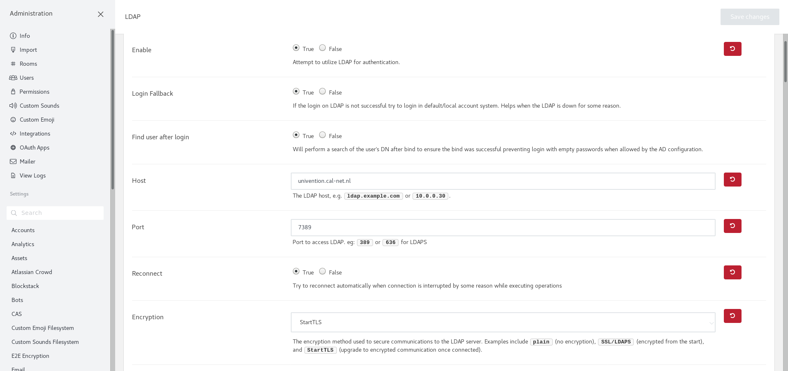
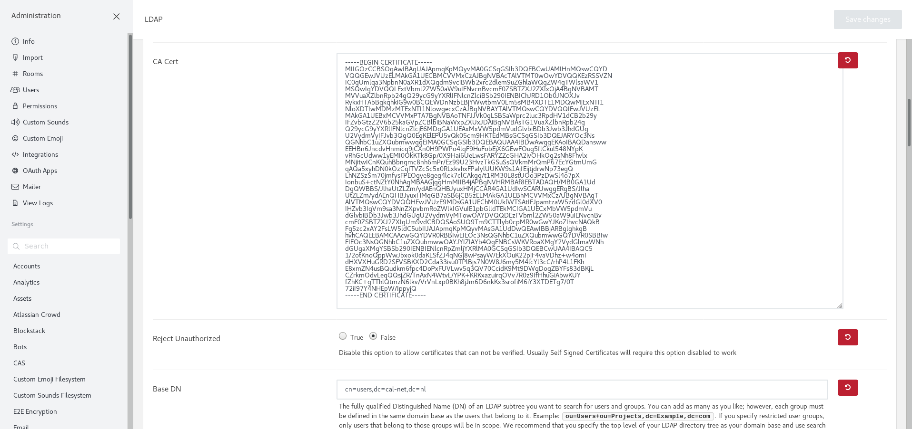
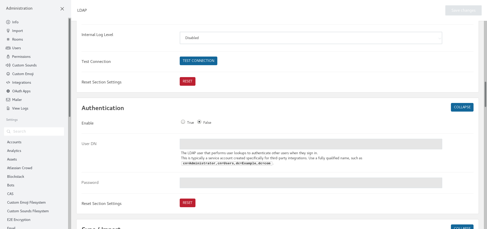
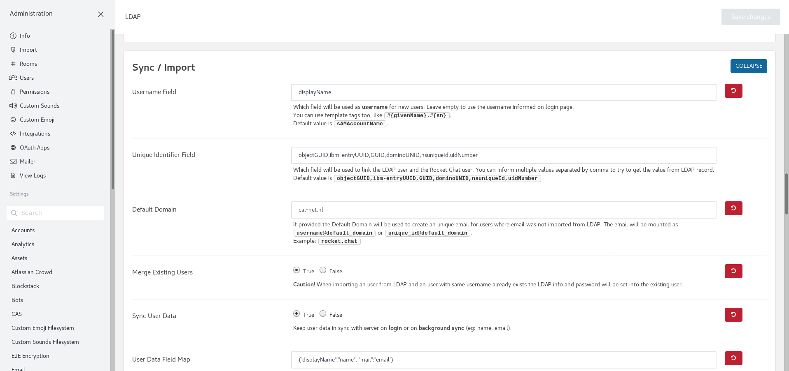
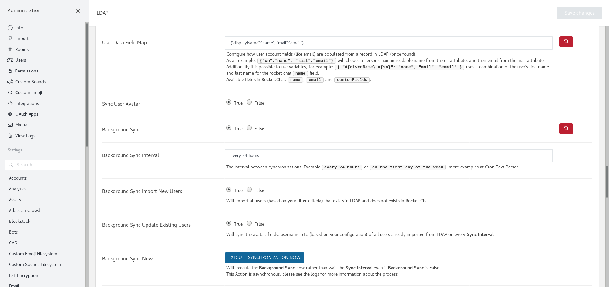
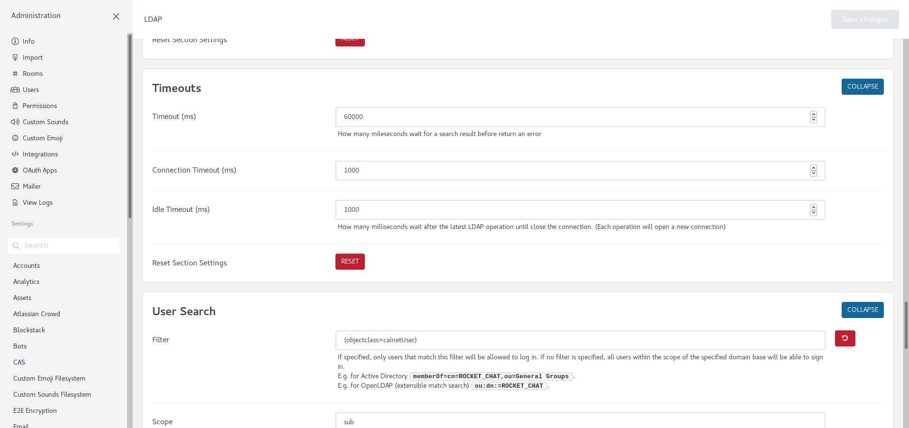
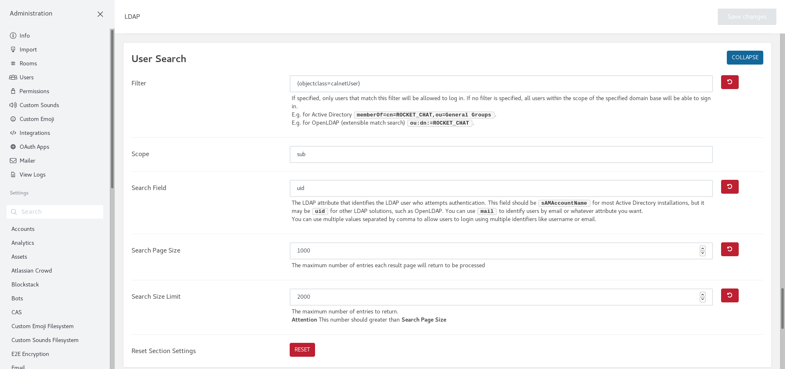
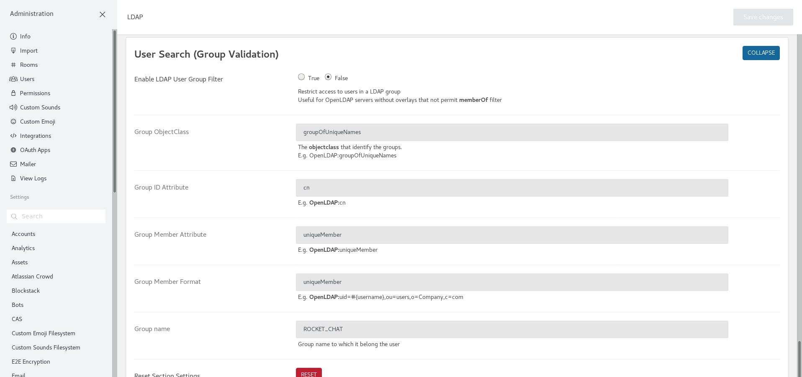

# RocketChat

For the RocketChat server the existing `rocketchat.server` Ansible
Galaxy role is used.

But after installation some configuration has to be done, to make
RocketChat work with the LDAP server.

## Certificates

Of course all communication with the RocketChat server should be
secured. So SSL is used.

For SSL two extra files are needed, the certificate and the private-key.
As these files do contain sensitive information, these files are
encrypted with the `ansible-vault` command.

```
ansible-vault encrypt chatterbox.example.net.key
ansible-vault encrypt chatterbox.example.net.pem
```

!!! warning
    The Nginx SSL certificates are placed in the `setup` role in the
    directory `files/rocketchat`. These *should* be named
    `{{ inventory_hostname }}.pem` and `{{ inventory_hostname }}.key`
    and these are placed on the RocketChat server in `/etc/nginx`.

## Create monitoring user

Start the MongoDB commandline utility with

```
mongo
```

And issue the following commands

```
use admin
db.createUser(
  {
     user: "<username>",
     pwd: "<password>",
     roles: [ { role: "clusterMonitor", db: "admin" } ]
  }
)
```

## Connect to LDAP

The configuration is done in the 'Administration' pane and then clicking
the `LDAP` option.

















